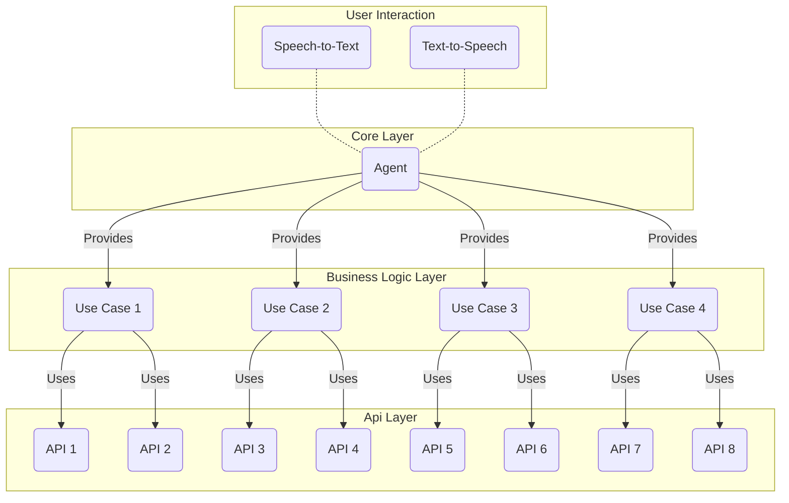

HiBuddy ist ein Sprachassistent, der dir dabei helfen soll, den Alltag zu meistern. Er kann beispielsweise helfen, deine Einkäufe zu planen, dir den Wetterbericht für die nächsten Tage mitteilen oder dir die neuesten Nachrichten vorlesen.

## Architektur

Die Architektur des Projekts unterteilt sich in vier Schichten: den User Interaction Layer, den Core Layer, den Business Logic Layer und den API Layer.

In der User Interaction Layer werden die Spracheingaben des Nutzers in Text umgewandelt, und die Textausgaben des Systems werden in Sprache umgewandelt. Diese Schicht ist für die Kommunikation mit dem Nutzer verantwortlich. Die Spracheingaben werden an den Core Layer weitergeleitet, und die Textausgaben werden vom Core Layer entgegengenommen.

Der Core Layer ist für die Verarbeitung der Spracheingaben zuständig. Er leitet die Spracheingaben an den Business Logic Layer weiter und nimmt die Textausgaben des Business Logic Layer entgegen.

Der Business Logic Layer ist für die Verarbeitung der Spracheingaben verantwortlich. Er leitet die Spracheingaben an den API Layer weiter und verarbeitet die Ergebnisse der API Layer.

Der API Layer ist für die Kommunikation mit den APIs zuständig. Er nimmt die Spracheingaben des Business Logic Layer entgegen und leitet die Ergebnisse der APIs an den Business Logic Layer weiter.

## Lizenz

Die Lizenz für dieses Projekt ist die [MIT](https://github.com/felixhoffmnn/aswe/blob/main/LICENSE) Lizenz.
